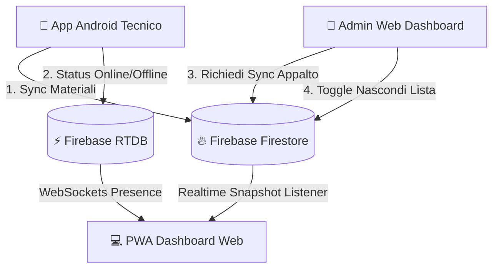

<div align="center">

# 💻 TechnicalWork Dashboard — Web Portal

**La Web Application Progressive (PWA) moderna, ad alte prestazioni e zero-costi per il monitoraggio in tempo reale dei cantieri, dei tecnici sul campo, della movimentazione dei materiali e delle risorse geografiche PFS.**

[](https://vitejs.dev/)
[](https://developer.mozilla.org)
[](https://firebase.google.com/)
[](https://web.dev/progressive-web-apps/)
[](https://pages.github.com/)

---

</div>

## 🌟 Funzionalità Principali

### 📊 Monitoraggio Materiali & Cantieri Live
- **Griglia Dati Reattiva in Tempo Reale**: Visualizzazione immediata della situazione materiali per ciascun tecnico divisa per appalto (*Elecnor*, *Sertori*, *Sirti*, *Consumo*).
- **Snapshot Storici con Hash Routing**: Consultazione delle registrazioni passate (*Oggi, Ieri e giorni precedenti*) con tracciamento temporale preservato.
- **Editing Inline Istantaneo**: Modifica diretta delle quantità materiali con doppio click da parte dell'Amministratore (supporta numeri ed espressioni es. `10 + 2 sparati`).
- **Pulsante "Richiedi Sync Appalto"**: Trigger on-demand nel menu Admin per sollecitare il caricamento immediato dei dati dall'app Android dei tecnici senza attese.
- **Gestione "Nascondi / Riabilita Lista"**: Possibilità per l'Admin di oscurare momentaneamente le liste errate o non desiderate (nascoste ai Non-Admin, visibili all'Admin con opacità ridotta `opacity: 0.45`).

### 👷 Gestione Tecnici & Presenza Real-Time
- **Realtime Database (RTDB) Presence**: Monitoraggio stato online/offline zero-costo tramite WebSockets senza consumo di quote scritture Firestore.
- **Identificazione Dispositivo**: Distinzione visiva tra utenti Web/PC (`💻`) e smartphone Android (`📱`).
- **Gps & Telemetria**: Visualizzazione posizione Google Maps, percentuale batteria del dispositivo e versione dell'app utilizzata.
- **Amministrazione Avanzata**: Rinomina tecnici, disattivazione visibilità e sistema di Killswitch per blocco dispositivi.

### 🗺️ Navigatore Geografico & Lookup PFS
- **PFS Lookup & Aree Preferite**: Ricerca rapidissima di snodi e PFS regionali con paginazione DOM ad alte prestazioni (limite 100 elementi per evitare crash su dispositivi mobili/iOS).
- **Gestione Notifiche PFS**: Allerta PWA nativa per nuove segnalazioni di armadi danneggiati o indirizzi errati inviate dal campo.

### 🎨 Design System & Accessibilità
- **Tema Cyberpunk Dark / Light**: Fogli di stile modularizzati con tavolozza colori ad alto contrasto per ambienti di cantiere e ufficio.
- **Mobile-First & Touch Safe**: Target touch minimi di 44px conformi alle linee guida **WCAG 2.2**, supporto gesture mobile e safe areas per iOS.
- **Esportazione & Stampa**: Export in formato Excel `.xlsx`, stampa formattata e generazione di immagini PNG ad alta risoluzione con condivisione nativa per WhatsApp.

---

## 🏗️ Architettura & Zero-Cost Policy



### Principi di Ottimizzazione Billing (Piano Spark)
1. **Zero Heartbeat su Firestore**: La presenza in tempo reale utilizza esclusivamente Firebase Realtime Database (RTDB).
2. **Pub/Sub Cache in-Memory**: Un unico listener centralizzato gestisce i dispositivi senza duplicare letture Firebase.
3. **Cache-Busting CDN GitHub**: Aggiornamenti automatici delle configurazioni e masterList via query string `?t=timestamp`.

---

## 🛠️ Stack Tecnologico

- **Bundler & Dev Server**: Vite 8.x + `vite-plugin-pwa` (Workbox Service Worker, offline caching).
- **Frontend Core**: Vanilla JavaScript ES6+ (Modular architecture, Zero framework lock-in).
- **Cloud Database**: Firebase Firestore KTX + Firebase Realtime Database.
- **Styling**: CSS Custom Properties modularizzato in `css/components/` (WCAG 2.2 Accessibilità, Responsive grid).
- **Export Engine**: ExcelJS (CDN) + Canvas Image Renderer per esportazione `.png`.
- **Hosting**: GitHub Pages (`/docs` directory).

---

## 📁 Struttura del Progetto

```
tchwrk2/
├── index.html                  # HTML5 SPA Entry Point & Layout Structure
├── aggiorna_github.bat         # Script automatico di Build e Deploy su GitHub
├── js/
│   ├── app.js                  # Entry point, Router SPA, Theme & Presence Init
│   ├── data.js                 # Rendering Tabella Materiali, Inline Editor & Sync
│   ├── state.js                # Gestione Stato Globale, User Role & Caches
│   ├── tecnici.js              # Gestione Pannello Admin Tecnici e Bloccati
│   ├── pfsLookup.js            # Lookup geografico PFS e Paginazione DOM
│   ├── export.js               # Motore Esportazione Excel, Stampa e Immagini PNG
│   └── firebase.js             # Inizializzazione SDK Firebase Firestore/RTDB
├── css/
│   ├── components/             # Fogli di stile modularizzati per componente
│   ├── main.css                # Variabili cromatiche e reset base
│   └── responsive.css          # Regole Layout Mobile & Touch Targets
└── tasks/                      # Registro decisioni architetturali e storico lezioni
```

---

## 🚀 Sviluppo & Deploy

### Avvio Locale (Dev Server)
```bash
# Installazione dipendenze
npm install

# Avvio server locale Vite
npm run dev
```

### Pubblicazione Automatica su GitHub Pages
Per compilare la versione ottimizzata per la produzione e pubblicarla online con un solo click:

1. Fai doppio click sul file **`aggiorna_github.bat`**.
2. Lo script eseguirà in automatico `npm run build`, creerà il commit ed invierà l'aggiornamento su GitHub Pages!

---

<div align="center">
  <sub>Sviluppato con ❤️ per il monitoraggio centralizzato dei cantieri **Technicalwork**.</sub>
</div>
